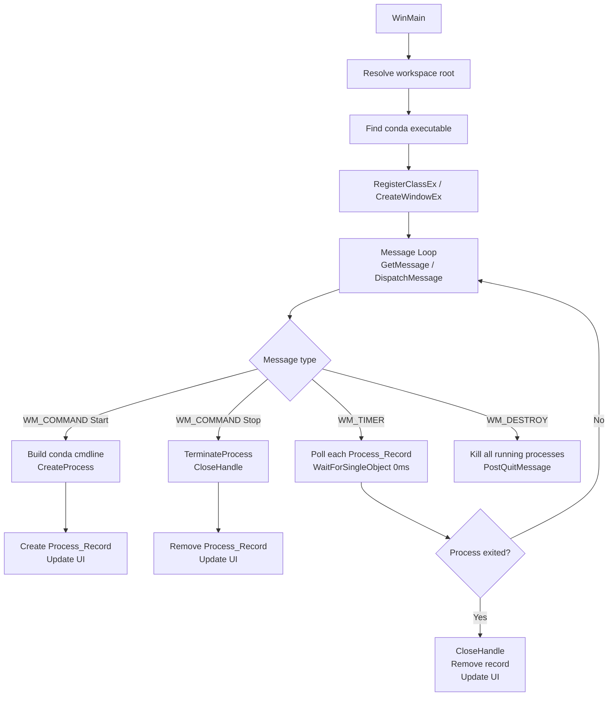

# Design Document: bootstrap-app-launcher

## Overview

The bootstrap-app-launcher is a single-file native Windows executable (`bootstrap/launcher.exe`) compiled from C (`bootstrap/launcher.c`) using gcc/mingw. It provides a minimal Win32 GUI for launching and stopping four Python applications that live in the workspace, all run inside the `vibevoice` conda environment via `conda run -n vibevoice python <script>`.

Key design goals:
- Zero runtime dependencies — only standard Windows system DLLs
- Single C source file, single compiled binary
- All app definitions in one place (a static array of `App_Entry` structs)
- Process lifecycle fully managed via Win32 API (`CreateProcess`, `TerminateProcess`, `WaitForSingleObject`)

---

## Architecture

The launcher is a single-threaded Win32 application. All work happens on the main thread driven by the Windows message loop. A `WM_TIMER` message fires every 500 ms to poll process status.



### Threading Model

Single-threaded. The message loop handles all UI events. The 500 ms timer provides process-status polling without blocking the UI. `CreateProcess` is called with `CREATE_NO_WINDOW` so child console windows don't appear.

---

## Components and Interfaces

### 1. App Registry (`app_entries[]`)

A static C array of `App_Entry` structs defined at the top of `launcher.c`. This is the single location that must be edited to add or change managed apps.

```c
static App_Entry app_entries[] = {
    { "VibeVoice Main",   "main_new.py",          ""             },
    { "Recite",           "Recite\\app.py",        "Recite"       },
    { "PDF Reader",       "PDFReader\\main.py",    "PDFReader"    },
    { "Quick Translate",  "QuickTranslate\\main.py","QuickTranslate"},
};
#define APP_COUNT (sizeof(app_entries) / sizeof(app_entries[0]))
```

Each entry carries:
- `name` — display label in the UI
- `script` — path relative to workspace root
- `subdir` — working directory relative to workspace root (empty = workspace root)

### 2. Conda Activator

A C function `build_conda_cmdline()` that:
1. Resolves the conda executable by checking `CONDA_EXE` env var, then `PATH`, then four hardcoded fallback paths
2. Constructs the full command string: `"<conda_exe>" run -n vibevoice python "<script_abs_path>"`
3. Returns the command string and the working directory path for `CreateProcess`

```c
int find_conda(char *out_path, size_t out_size);
void build_conda_cmdline(const char *workspace_root,
                         const App_Entry *entry,
                         char *cmdline_out, size_t cmdline_size,
                         char *cwd_out,     size_t cwd_size);
```

### 3. Process Manager

Functions that wrap `CreateProcess` / `TerminateProcess` / `WaitForSingleObject`:

```c
int  start_app(int index);   // spawns process, fills process_records[index]
void stop_app(int index);    // terminates process, clears process_records[index]
void poll_processes(void);   // called from WM_TIMER; checks all active records
void kill_all(void);         // called from WM_DESTROY
```

### 4. Win32 Window

Created in `WinMain`. Layout is fixed-size. For each app row the window contains:
- A static text label (app name)
- A colored status indicator (owner-drawn static control or simple rectangle painted in `WM_PAINT`)
- A "Start" button (`HWND`)
- A "Stop" button (`HWND`)

Control IDs are computed as `BASE_ID + (index * CONTROLS_PER_ROW) + OFFSET`.

```c
#define ID_START(i)  (100 + (i)*4 + 0)
#define ID_STOP(i)   (100 + (i)*4 + 1)
#define ID_STATUS(i) (100 + (i)*4 + 2)
```

`update_ui(int index)` enables/disables Start/Stop buttons and repaints the status indicator based on whether `process_records[index]` is active.

### 5. Build System

`bootstrap/build.bat` — a simple batch file:

```bat
@echo off
gcc -o launcher.exe launcher.c -mwindows -luser32 -lgdi32 -lkernel32
```

Optionally a `bootstrap/Makefile` for `make` users:

```makefile
launcher.exe: launcher.c
	gcc -o launcher.exe launcher.c -mwindows -luser32 -lgdi32 -lkernel32
```

---

## Data Models

### App_Entry (C struct)

```c
typedef struct {
    char name[64];      // Display name shown in UI
    char script[256];   // Script path relative to workspace root
    char subdir[256];   // Working directory relative to workspace root
} App_Entry;
```

### Process_Record (C struct)

```c
typedef struct {
    HANDLE hProcess;    // Win32 process handle (NULL = not running)
    DWORD  pid;         // Process ID (0 = not running)
} Process_Record;
```

A static array `Process_Record process_records[APP_COUNT]` is zero-initialized at startup. `hProcess == NULL` means the app is not running.

### UI Control Handles

```c
static HWND hwnd_start[APP_COUNT];
static HWND hwnd_stop[APP_COUNT];
static HWND hwnd_status[APP_COUNT];  // static controls used as color indicators
```

### Window Layout Constants

```c
#define WINDOW_WIDTH   420
#define WINDOW_HEIGHT  (60 + APP_COUNT * 50)
#define ROW_HEIGHT     50
#define ROW_PADDING    10
```

---

## Correctness Properties

*A property is a characteristic or behavior that should hold true across all valid executions of a system — essentially, a formal statement about what the system should do. Properties serve as the bridge between human-readable specifications and machine-verifiable correctness guarantees.*


### Property 1: Script path resolution is relative to workspace root

*For any* workspace root path and any `App_Entry`, the absolute script path produced by the path-resolution logic should equal the concatenation of the workspace root, a path separator, and the entry's `script` field.

**Validates: Requirements 1.2**

### Property 2: Conda search returns first found location

*For any* combination of `CONDA_EXE` environment variable, `PATH` entries, and fallback directory presence, `find_conda()` should return the path of the first location where a conda executable exists, checking in the order: `CONDA_EXE` → `PATH` → fallback list.

**Validates: Requirements 2.1**

### Property 3: Conda command line contains required components

*For any* conda executable path and any `App_Entry`, the command line produced by `build_conda_cmdline()` should contain the conda executable path, the literal tokens `run -n vibevoice python`, and the absolute script path — in that order.

**Validates: Requirements 2.3**

### Property 4: Conda working directory matches app subdirectory

*For any* workspace root and any `App_Entry`, the `cwd` output of `build_conda_cmdline()` should equal the workspace root joined with the entry's `subdir` field (or the workspace root itself when `subdir` is empty).

**Validates: Requirements 2.4**

### Property 5: Process record reflects running state after successful start

*For any* app index, after `start_app(index)` succeeds, `process_records[index].hProcess` should be non-NULL and the UI state for that index should indicate "running" with the Start button disabled and the Stop button enabled.

**Validates: Requirements 3.2, 3.3**

### Property 6: Process record is cleared and UI shows stopped after process ends

*For any* app index, after the process associated with `process_records[index]` is no longer active (whether stopped by the user or detected as exited by the poll), `process_records[index].hProcess` should be NULL, the Start button should be enabled, and the Stop button should be disabled.

**Validates: Requirements 4.2, 4.4, 5.2**

### Property 7: All process records are cleared on window close

*For any* launcher state with N running processes, after `kill_all()` is invoked (triggered by `WM_DESTROY`), every `process_records[i].hProcess` should be NULL for all i in [0, APP_COUNT).

**Validates: Requirements 6.4**

---

## Error Handling

| Scenario | Detection | Response |
|---|---|---|
| `conda` not found | `find_conda()` returns non-zero | `MessageBox` with list of searched paths; Start button remains disabled or aborts |
| `CreateProcess` fails | Return value is 0 | `MessageBox` with `GetLastError()` description; `process_records[i]` stays zeroed; Status_Indicator stays "stopped" |
| Process exits unexpectedly | Poll via `WaitForSingleObject(hProcess, 0)` returns `WAIT_OBJECT_0` | Close handle, zero record, update UI to "stopped" |
| `TerminateProcess` fails | Return value is 0 | Log via `OutputDebugString`; handle is still closed and record cleared to avoid leaks |
| Graceful stop timeout (3 s) | `WaitForSingleObject(hProcess, 3000)` returns `WAIT_TIMEOUT` | Call `TerminateProcess` forcefully |
| Path buffer overflow | `snprintf` return value ≥ buffer size | Abort with `MessageBox` indicating path too long |

All error messages shown to the user via `MessageBox(NULL, msg, "Launcher Error", MB_OK | MB_ICONERROR)`.

---

## Testing Strategy

### Dual Testing Approach

Both unit tests and property-based tests are required. Unit tests cover specific examples and error conditions; property-based tests verify universal correctness across all valid inputs.

### Unit Tests (specific examples and edge cases)

Written in C using a minimal test harness (or a lightweight framework like [greatest](https://github.com/silentbicycle/greatest) if available). Tests compile and run without the Win32 GUI — only the pure-logic functions are tested.

Key unit test cases:
- App registry has exactly 4 entries with the correct script paths (validates Req 1.1)
- `find_conda()` returns error when no conda is present anywhere (validates Req 2.2)
- `find_conda()` returns the `CONDA_EXE` path when that env var is set (validates Req 2.1 priority)
- `build_conda_cmdline()` produces correct output for a known root + entry (validates Req 2.3, 2.4)
- `start_app()` with a mock that fails `CreateProcess` leaves record zeroed (validates Req 3.4)
- Timer interval constant is ≤ 1000 ms (validates Req 5.1)
- Window dimension constants match expected fixed size (validates Req 6.5)
- After window creation, all `hwnd_start`, `hwnd_stop`, `hwnd_status` handles are non-NULL (validates Req 6.2)

### Property-Based Tests

Use [theft](https://github.com/silentbicycle/theft) (C property-based testing library) or a simple hand-rolled generator loop. Each property test runs a minimum of 100 iterations with randomized inputs.

Each test is tagged with a comment in the format:
`// Feature: bootstrap-app-launcher, Property <N>: <property_text>`

**Property 1 test** — generate random workspace root strings and verify path concatenation:
```c
// Feature: bootstrap-app-launcher, Property 1: script path resolution is relative to workspace root
// For any workspace root and app entry, resolved path == root + sep + script
```

**Property 2 test** — generate random combinations of env var / PATH / fallback presence and verify search order:
```c
// Feature: bootstrap-app-launcher, Property 2: conda search returns first found location
```

**Property 3 test** — generate random conda paths and script paths, verify cmdline structure:
```c
// Feature: bootstrap-app-launcher, Property 3: conda command line contains required components
```

**Property 4 test** — generate random workspace roots and app entries, verify cwd output:
```c
// Feature: bootstrap-app-launcher, Property 4: conda working directory matches app subdirectory
```

**Property 5 test** — simulate successful `CreateProcess` (mock), verify record and UI state:
```c
// Feature: bootstrap-app-launcher, Property 5: process record reflects running state after successful start
```

**Property 6 test** — simulate process exit detection, verify record cleared and UI updated:
```c
// Feature: bootstrap-app-launcher, Property 6: process record is cleared and UI shows stopped after process ends
```

**Property 7 test** — generate N running mock process records, call `kill_all()`, verify all cleared:
```c
// Feature: bootstrap-app-launcher, Property 7: all process records are cleared on window close
```

### Test Build

Tests live in `bootstrap/test_launcher.c` and are compiled separately:

```bat
gcc -o test_launcher.exe test_launcher.c -lkernel32
test_launcher.exe
```

The test binary does not link `-mwindows` so it runs as a console application.
